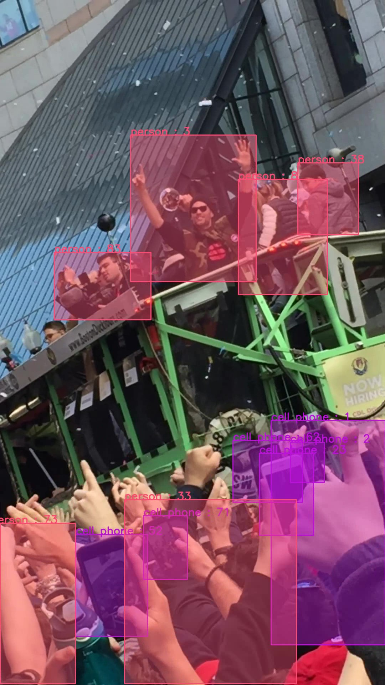

# Fast-Track 🚀

Module for object tracking pipelines with runtime optimized YOLOv8 and YOLOv7 object detection and BYTETracker object tracking.



## Installation:

Package is installable with Python 3.8+

1. `git clone <repo> && cd <repo>`
1. `pip install .`

## Running:

1. Example usage:
    ```
    import cv2
    import yaml

    from fast_track import Pipeline
    from fast_track.object_detection import YOLOv8
    from fast_track.object_tracking import BYTETracker


    if __name__ == '__main__':
        with open('config/coco.yml', 'r') as f:
            config = yaml.safe_load(f)

        camera = cv2.VideoCapture(config['data_path'])
        detector = YOLOv8(**config['detector'], names=config['names'], image_shape=(camera.get(3), camera.get(4)))
        tracker = BYTETracker(**config['tracker'], names=config['names'])

        with Pipeline(camera=camera, detector=detector, tracker=tracker, outfile=config['outfile']) as p:
            p.run()
    ```

## Contact:
Author: Nate Haddad - nhaddad2112[at]gmail[dot]com

## License:
[See LICENSE.txt](LICENSE.txt)

## References:
[1] Jocher, Glenn; "YOLOv8 in PyTorch > ONNX > CoreML > TFLite"; https://github.com/ultralytics/; 2023; [Online]. Available: https://github.com/ultralytics/ultralytics 

[2] Wang, Chien-Yao and Bochkovskiy, Alexey and Liao, Hong-Yuan Mark; "YOLOv7: Trainable bag-of-freebies sets new state-of-the-art for real-time object detectors"; https://github.com/WongKinYiu/; 2022; [Online]. Available: https://github.com/WongKinYiu/yolov7

[3] Gorordo, Ibai; "ONNX YOLOv7 Object Detection"; https://github.com/ibaiGorordo/; 2022; [Online]. Available: https://github.com/ibaiGorordo/ONNX-YOLOv7-Object-Detection

[4] Zhang, Yifu and Sun, Peize and Jiang, Yi and Yu, Dongdong and Weng, Fucheng and Yuan, Zehuan and Luo, Ping and Liu, Wenyu and Wang, Xinggang; "ByteTrack: Multi-Object Tracking by Associating Every Detection Box"; https://github.com/ifzhang; 2022; [Online]. Available: https://github.com/ifzhang/ByteTrack
